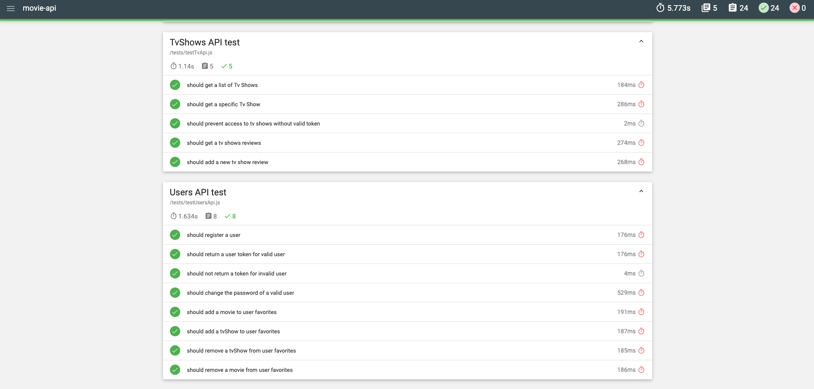

# Assignment 2 - Web API.

Name: Aaron Mooney

## Overview

This API can be used to fetch information about movies, tv shows or people in the film industry. The data is fetched from TMDb API (The Movie Database API). This api has some protected routes and authentication is required to access these routes. Users can register for an account or login to an existing account using the API and are assigned a JWT token which is used for authentication. Users can add movies or tv shows to their list of favorites or remove them as they please. They may also change their password if they wish.

## Installation Requirements

Describe what needs to be on the machine to run the API (Node v?, NPM, MongoDB instance, any other 3rd party software not in the package.json). 


Node.JS, can be downloaded [here] (https://nodejs.org/en/download/) (v12.14.1 was used for development)

NPM - included with Node.JS (v6.13.4 was used for development)

(Optional) Git, found [here] (https://git-scm.com/downloads) - if cloning this repo

## API Configuration
Describe any configuration that needs to take place before running the API. For example, creating an ``.env`` and what variables to put in it. Give an example of how this might be structured/done.
REMEMBER: DON'T PUT YOUR OWN USERNAMES/PASSWORDS/AUTH KEYS IN THE READ.ME.
Create a **.env** file in the root directory of this project and insert the following variables.

```bat
NODE_ENV=development
PORT=8080
HOST=localhost
TMDB_KEY=yourAPIKey
mongoDB=YourMongoURL
seedDb=true
secret=YourJWTSecret
```
## Startup
### Prerequisite
Before running the API or associated tests, make sure you have all of the required dependencies by running

```npm install```

### Starting the API
In a terminal, run these commands in the project root directory.

```npm start```

### Stopping the API
In order to stop the API, you can press ```Ctrl + C```

### Running unit tests
In the root directory of the project, you can run this command to run the unit tests

```npm run unit-test```

### Running API tests
In the root directory of the project, you can run this command to run the API tests

```npm run test```

## API Design
Give an overview of your web API design. If you don't have a Swagger description, you could describe similar to the following: 

| Route| GET| POST| PUT| DELETE|
| ---- |:--:| ---:|---:|------:|
| /api/movies/ | Gets a list of movies| N/A | N/A | N/A |
| /api/movies/trending | Gets a list of trending movies this week| N/A | N/A | N/A |
| /api/movies/upcoming | Gets a list of upcoming movies | N/A | N/A | N/A |
| /api/movies/{movieId} | Get a movie| N/A | N/A | N/A |
| /api/movies/{movieId}/reviews | Get a movie's reviews| Post a new movie review | N/A | N/A |
| /api/tvShows/ | Gets a list of tv shows| N/A | N/A | N/A |
| /api/tvShows/trending/ | Gets a list of trending tv shows this week| N/A | N/A | N/A |
| /api/tvShows/{tvShowId} | Get a tv show| N/A | N/A | N/A |
| /api/tvShows/{tvShowId}/reviews | Get a tv show's reviews| Post a new tv show review | N/A | N/A |
| /api/genres/ | Gets a list of genres| N/A | N/A | N/A |
| /api/users/ | Gets a list of users| Register/Login a user | N/A | N/A |
| /api/users/{userName} | N/A| N/A | Update a user | N/A |
| /api/users/{userName}/password | N/A| N/A | Update a user's password | N/A |
| /api/users/{userName}/favorites/movies | Get a user's favorite movies| N/A | Update a user's favorite movies with a new entry | N/A |
| /api/users/{userName}/favorites/tv | Get a user's favorite tv shows| N/A | Update a user's favorite tv shows with a new entry | N/A |
| /api/users/{userName}/favorites/movies/{movieId} | N/A| N/A | N/A | Delete a movie from a user's favorites |
| /api/users/{userName}/favorites/tv/{tvShowId} | N/A| N/A | N/A | Delete a tv show from a user's favorites |


## Security and Authentication
Some routes of the API are protected and authentication is required to reach them. This authentication is handled by **passport** and **JWT**. A user must first login to the API where they will be assigned a token that can be used for future requests.

Protected Routes

- /movies/
- /tvShows/
- /person/
- /genres/

Public Routes

- /users/

## Testing
The test in this application are separated into two parts. Unit tests & Integration tests.

### Unit Tests
These tests will test the schemas of movies, tv shows, users and people.

##### Movie Schema test
Creates a valid and invalid movie object and performs the following tests.

- Validate a movie with an ID
- Invalidate a movie without an ID (required)

##### Person Schema test
Creates a valid and invalid person object and performs the following tests.

- Validate a person with an ID
- Invalidate a person without an ID (required)

##### Tv Show Schema test
Creates a valid and invalid tv show object and performs the following tests.

- Validate a tv show with an ID
- Invalidate a tv show without an ID (required)

##### User Schema test
Creates a valid and invalid user object and performs the following tests.

- Validate a user with a username and password
- Invalidate a user without a username and password (required)
- Search for a user by username
- Detect matching passwords

### Integration Tests
These tests will test the functionality of the API and verify if the results are what is expected.

##### /api/Movies/ tests
- Get a list of movies on each of these paths
	- / 
	-  /trending
	-  /upcoming
- Get a specific movie
- Prevent access to /movies/ without a valid authentication token
- Get a movie's reviews
- Add a new movie review

##### /api/tvShows/ tests
- Get a list of tv shows on each of these paths
	- / 
	-  /trending
- Get a specific tv show
- Prevent access to /tvShows/ without a valid authentication token
- Get a tv show's reviews
- Add a new tv show review

##### /api/person/ tests
- Get a list of people
- Get a specific person
- Prevent access to /person/ without a valid authentication token
- Get a person's credits

##### /api/genres/ tests
- Get a list of genres
- Prevent access to /genres/ without a valid authentication token

##### /api/users/ tests
- Register a new user
- Return a authentication token for a valid user
- Do not return an authentication token for an invalid user
- Change the password of a valid user
- Add a movie to user favorites
- Add a tv show to user favorites
- Remove a movie from user favorites
- Remove a tv show from user favorites



## Integrating with React App

This API is integrated with the Movies react application [here](https://github.com/AaronMooney/react-assignment-one)

Here are an example of a GET, POST, PUT and DELETE

~~~Javascript
export const getMovies = () => {
  return fetch(
    '/api/movies/',{headers: {
    'Authorization': window.localStorage.getItem('token')
    }
  })
    .then(res => res.json())
    .then(json => {return json.results;})
    .catch(err => console.log(err));
};
~~~
~~~Javascript
//POST
export const addMovieReview = (data) => {
  const {movieId, author, content} = data
  return fetch(
    `/api/movies/${movieId}/reviews`,{
      method: 'POST',
      headers: {
        'Accept': 'application/json',
        'Content-Type': 'application/json',
        'Authorization': window.localStorage.getItem('token')
      },
      body: JSON.stringify({author, content})
    }
  ).then(res => res.json())
}
~~~
~~~Javascript
export const addFavoriteMovie = (movie, userId) => {
  return fetch(
    `/api/users/${userId}/favorites/movies`,{
      method: 'PUT',
      headers: {
        'Accept': 'application/json',
        'Content-Type': 'application/json',
        'Authorization': window.localStorage.getItem('token')
      },
      body: JSON.stringify(movie)
    }
  ).then(res => res.json())
}
~~~
~~~Javascript
export const removeFavoriteMovie = (userName, id) => {
  return fetch(
    `/api/users/${userName}/favorites/movies/${id}`,{
      headers: {
        'Authorization': window.localStorage.getItem('token')
      },
      method: 'DELETE',
    }
  ).then(res => res.json())
}
~~~

## Independent learning.

I had some issues initially creating the movie and tv show objects in MongoDB when calling the API and I had some problems getting this to work as I kept running into unhandled promise exceptions. So I did some extra research on promises and how best to handle them.
